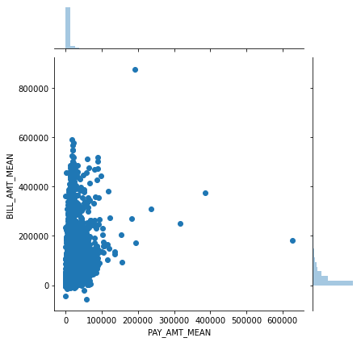

# Exploratory Data Analysis

In this 5 part walk-through, I'll demonstrate a simple Machine Learning project to build a classifier model.

In this step, we will perform some statistical and graphical analysis on some of the important individual variables to get a better understanding of the dataset, the domain and the problem.
<!--end-excerpt-->

## 1. Pre-Requisites
#### 1.1. Libraries


```python
#data storage and organization
import pandas #storage
import numpy as np #data-type conversion
from os import getcwd

#visual analysis
%matplotlib inline
import seaborn
import matplotlib.pyplot as plt  #allows modifying plots

#statistical analysis
    #Chi-Squared test
from scipy.stats import chi2_contingency
    #ANOVA
from scipy.stats import f_oneway
    #MANOVA (Multivariate Analysis of Variance)
from statsmodels.multivariate.manova import MANOVA
```

Converter functions


```python
def cvSex(sex):
    mapper = {1: 'Male', 2: 'Female'}
    return mapper.get(sex)

def cvEducation(education):
    mapper = {1: 'Graduate', 2: 'University', 3: 'High School', 4: 'Others'}
    return mapper.get(education, 'Others') #takes care of cases 0, 5 and 6

def cvMarriage(marriage):
    mapper = {1: 'Married', 2: 'Single', 3: 'Divorced', 4: 'Others'}
    return mapper.get(marriage, 'Others') #takes care of 54 entries

def cvPayHistory(payHistory):
    mapper = {-2: 'No Credit Use', -1: 'Paid in Full', 0: 'Revolving Credit Used', 1: 'Delay 1 of month', 2: 'Delay 2 of months', 3: 'Delay 3 of months', 4: 'Delay 4 of months', 5: 'Delay 5 of months', 6: 'Delay 6 of months', 7: 'Delay 7 of months', 8: 'Delay 8 of months', 9: 'Delay 9 of months OR more'}
    return mapper.get(payHistory)

def cvDefPay(prediction):
    mapper = {0: False, 1: True}
    return mapper.get(prediction)
```

#### 1.2. Importing the dataset

API Docs: [Pandas DataFrame read_excel()](https://pandas.pydata.org/pandas-docs/stable/reference/api/pandas.read_excel.html)


```python
url = getcwd() + '\\default of credit card clients.xls'
ccd = pandas.read_excel(io = url, \
  sheet_name='Data', header = 1, index_col = 0, \
  dtype = {'LIMIT_BAL': np.int32, 'AGE': np.int32, 'BILL_AMT1': np.int32, 'BILL_AMT2': np.int32, 'BILL_AMT3': np.int32, 'BILL_AMT4': np.int32, 'BILL_AMT5': np.int32, 'BILL_AMT6': np.int32, 'PAY_AMT1': np.int32, 'PAY_AMT2': np.int32, 'PAY_AMT3': np.int32, 'PAY_AMT4': np.int32, 'PAY_AMT5': np.int32, 'PAY_AMT6': np.int32}, \
  converters = {'SEX': cvSex, 'EDUCATION': cvEducation, 'MARRIAGE': cvMarriage, 'default payment next month': cvDefPay, 'PAY_0': cvPayHistory, 'PAY_2': cvPayHistory, 'PAY_3': cvPayHistory, 'PAY_4': cvPayHistory, 'PAY_5': cvPayHistory, 'PAY_6': cvPayHistory,})
```

__dtype__ changed from int64 to int32 to save space and speed up computation, however, while doing so, we should firstly know that there won't be any overflow or underflow of data.

__converters__ utilize the previously defined converter methods to transform categorical data into a better understandable format. It's not needed for solving the classification problem, but just to understand the data we are working with.

#### 1.3. Bringing variables' names upto convention


```python
ccd.rename(columns = {'PAY_0': 'PAY_1'}, inplace = True)
ccd.rename(columns = {'default payment next month': 'default_payment_next_month'}, inplace = True)
```

## Exploratory Data Analysis

I won't be going through all the variables and combinations thereof, just a few as examples. Also, in case of very large datasets, through EDA might not be possible, in such cases we go through only the more 

### Segments:
#### 1. Personal

#### 2. Financial
1. Expended
2. Paid
3. Behavior

## 2. Exploratory Data Analysis
### 2.1. Overall Dataset EDA


```python
#check for missing values
ccd.isnull().values.any()
```

!!! example "Output"
    ```python
    False
    ```


### 2.2. Variable wise' EDA

#### Univariate:
1. Distribution
2. Outlier detection

#### Bivariate:
1. Continuous - Continuous: Correlation Co-efficient{Pearson, Spearman}. [-1 <= p-value >= +1]

2. Continuous - Categorical: Analysis of Variance(ANOVA): Determine whether the differences between group means are statistically significant. [α = 0.05]

3. Categorical - Categorical: Chi-Square test. [α > 0.05 for insignificance]

#### 2.2.a. LIMIT_BAL

Type - Numerical - Continuous - Ratio

Segment - Financial - Behavior

Comments - None

##### i> Univariate


```python
#for distribution and density
seaborn.distplot(a = ccd['LIMIT_BAL'], bins = ccd['LIMIT_BAL'].value_counts().size, kde = True, hist = True, rug = True)

#ccd['LIMIT_BAL'].value_counts().size == 81
```

!!! example "Output"

    ```shell
    <matplotlib.axes._subplots.AxesSubplot at 0x18d4e3b0148>
    ```
    
    


```python
#for outliers
seaborn.boxplot(x = 'LIMIT_BAL', data = ccd)
```

!!! example "Output"
  
    ```shell
    <matplotlib.axes._subplots.AxesSubplot at 0x18d55f26f48>
    ```
    
    


##### ii> Bivariate Graphical


```python
#for relation between LIMIT_BAL and target variable
seaborn.violinplot(x = ccd['default_payment_next_month'], y = ccd['LIMIT_BAL'])
```

!!! example "Output"

    ```shell
        <matplotlib.axes._subplots.AxesSubplot at 0x18d55fbf0c8>
    ```
    
    


```python
#for relation between LIMIT_BAL and AGE
seaborn.jointplot(x = ccd['LIMIT_BAL'], y = ccd['AGE'], kind = 'kde')
```

!!! example "Output"

    
    


##### iii> Bivariate Statistical


```python
ccd.groupby('default_payment_next_month').agg([np.mean, np.median, np.count_nonzero, np.std]).LIMIT_BAL
```

!!! example "Output"
  
    | default_payment_next_month | mean          | median | count_nonzero | std           |
    | :------------------------: | :-----------: | :----: | :-----------: | :-----------: |
    | False                      | 178099.726074 | 150000 | 23364         | 131628.359660 |
    | True                       | 130109.656420 |  90000 |  6636         | 115378.540571 |


##### iii> b. ANOVA - F One-Way


```python
f_oneway(ccd['LIMIT_BAL'][ccd['default_payment_next_month'] == True],
        ccd['LIMIT_BAL'][ccd['default_payment_next_month'] == False])
```

!!! example "Output"

    ```python
        F_onewayResult(statistic=724.0685392611651, pvalue=1.3022439532706416e-157)
    ```


##### iv> Conclusion
Expectation - 
1. Balance limit will vary with age (professionals accumulate wealth over their career, thus allotting them higher limits as they age is logical.)
2. Majority of credit availers are likely to have lower limit, possibly sharing the same LIMIT_BAL bracket.

Conclusion -
1. (Plot 3) Distribution is highly concentrated on [20>=AGE<=30, 0>=LIMIT_BAL<=200000], however distribution is also expanding on the axes.
2. True, defaulters are more likely to be having LIMIT_BAL in lower limits (LIMIT_BAL <= 200000). (Plot 1)
3. People with higher LIMIT_BAL are less likely to default. (LIMIT_BAL >= 400000) (Plot 2 density, Crosstab)
4. One-Way ANOVA: p-value being below 0.05, difference between means is statistically significant to a very high degree. There exists a strong relation between LIMIT_BAL and 'default payment'.

Comments - The variable being 'Balance Limit' is likely to be directly correlated to wealth, it's not unusual to have outliers.

#### 2.2.b. PAY {PAY_1 to PAY_6}

Type - Categorical - Ordinal

Segment - Financial - Behavior

!!! info "Legend" 

    {PAY_1: September 2005, PAY_2: August 2005, PAY_3: July 2005, PAY_4: June 2005, PAY_5: May 2005, PAY_6: April 2005}

    {-2: 'No Credit Use', -1: 'Paid in Full', 0: 'Revolving Credit Used', 1: 'Delay 1 of month', 2: 'Delay 2 of months', 3: 'Delay 3 of months', 4: 'Delay 4 of months', 5: 'Delay 5 of months', 6: 'Delay 6 of months', 7: 'Delay 7 of months', 8: 'Delay 8 of months', 9: 'Delay 9 of months OR more'}


##### i> Dimensionality Reduction
NOTE: Using mode to aggregate. An entry may have multiple mode values (same frequency), to resolve, using severest class.


```python
ccdr = pandas.read_excel(io = url, 
    sheet_name='Data', header = 1, index_col = 0)
ccdr.rename(columns = {'PAY_0': 'PAY_1'}, inplace = True)
```


```python
ccdHistory = ccd[['PAY_1', 'PAY_2', 'PAY_3', 'PAY_4', 'PAY_5', 'PAY_6']]
ccdrHistory = ccdr[['PAY_1', 'PAY_2', 'PAY_3', 'PAY_4', 'PAY_5', 'PAY_6']]
```

NOTE: Why severest value? To ensure fiscally fit population of credit users.


```python
ccdrHistoryMode = ccdrHistory.mode(axis = 'columns')
ccdrHistorySeverest = ccdrHistoryMode.apply(func = max, axis = 'columns')
ccdPayHistoryMode = map(cvPayHistory, ccdrHistorySeverest)
```


```python
ccd['PAY_MODE_SEVEREST'] = list(ccdPayHistoryMode)
```

##### ii> Univariate


```python
ccd['PAY_MODE_SEVEREST'].value_counts()
```

!!! example "Output"

    ```shell
        Revolving Credit Used    17076
        Paid in Full              5691
        No Credit Use             3897
        Delay 2 of months         3047
        Delay 3 of months          104
        Delay 7 of months           67
        Delay 4 of months           58
        Delay 8 of months           23
        Delay 5 of months           17
        Delay 6 of months           11
        Delay 1 of month             9
        Name: PAY_MODE_SEVEREST, dtype: int64
    ```


```python
ccd[ccd['PAY_MODE_SEVEREST'] == 'Delay 9 of months OR more']
```

!!! example "Output"

    | ID | LIMIT_BAL | SEX | EDUCATION | MARRIAGE | AGE | PAY_1 | PAY_2 | PAY_3 | PAY_4 | PAY_5 | ... | BILL_AMT5 | BILL_AMT6 | PAY_AMT1 | PAY_AMT2 | PAY_AMT3 | PAY_AMT4 | PAY_AMT5 | PAY_AMT6 | default_payment_next_month | PAY_MODE_SEVEREST | 
    | -- | --------- | --- | --------- | -------- | --- | ----- | ----- | ----- | ----- | ----- | --- | --------- | --------- | -------- | -------- | -------- | -------- | -------- | -------- | -------------------------- | ----------------- |
    |    |           |     |           |          |     |       |       |       |       |       |     |           |           |          |          |          |          |          |          |                            |                   |


```python
ccd['PAY_MODE_SEVEREST'].value_counts(normalize = True).mul(100).round(2).astype('str') + ' %'
```

!!! example "Output"

    ```shell
        Revolving Credit Used    56.92 %
        Paid in Full             18.97 %
        No Credit Use            12.99 %
        Delay 2 of months        10.16 %
        Delay 3 of months         0.35 %
        Delay 7 of months         0.22 %
        Delay 4 of months         0.19 %
        Delay 8 of months         0.08 %
        Delay 5 of months         0.06 %
        Delay 6 of months         0.04 %
        Delay 1 of month          0.03 %
        Name: PAY_MODE_SEVEREST, dtype: object
    ```


##### iii> Bivariate Graphical


```python
ax = seaborn.countplot(hue = 'default_payment_next_month', x = 'PAY_MODE_SEVEREST', data = ccd)

ax.set_xticklabels(ax.get_xticklabels(), rotation=40, ha="right")
plt.tight_layout()
```

!!! example "Output"

    
    


##### iv> Bivariate Statistical


```python
#category-wise
pandas.crosstab(index = ccd['default_payment_next_month'], columns = ccd['PAY_MODE_SEVEREST'], normalize = 'columns').mul(100).round(2).astype('str') + ' %'
```

!!! example "Output"

    | PAY_MODE_SEVEREST / default_payment_next_month | Delay 1 of month | Delay 2 of months | Delay 3 of months | Delay 4 of months | Delay 5 of months | Delay 6 of months | Delay 7 of months | Delay 8 of months | No Credit Use | Paid in Full | Revolving Credit Used |
    | :--------------------------------------------- | ---------------: | ----------------: | ----------------: | ----------------: | ----------------: | ----------------: | ----------------: | ----------------: | ------------: | -----------: | --------------------: |
    | False                                          | 88.89 %          | 39.32 %           | 26.92 %           | 41.38 %           | 41.18 %           | 36.36 %           | 16.42 %           | 43.48 %           | 80.47 %       | 83.36 %      | 83.12 %               |
    | True                                           | 11.11 %          | 60.68 %           | 73.08 %           | 58.62 %           | 58.82 %           | 63.64 %           | 83.58 %           | 56.52 %           | 19.53 %       | 16.64 %      | 16.88 %               |


```python
#target-wise
pandas.crosstab(index = ccd['default_payment_next_month'], columns = ccd['PAY_MODE_SEVEREST'], normalize = 'index').mul(100).round(2).astype('str') + ' %'
```

!!! example "Output"

    | PAY_MODE_SEVEREST / default_payment_next_month | Delay 1 of month | Delay 2 of months | Delay 3 of months | Delay 4 of months | Delay 5 of months | Delay 6 of months | Delay 7 of months | Delay 8 of months | No Credit Use | Paid in Full | Revolving Credit Used |
    | :--------------------------------------------- | ---------------: | ----------------: | ----------------: | ----------------: | ----------------: | ----------------: | ----------------: | ----------------: | ------------: | -----------: | --------------------: |
    | False                                          | 0.03 %           | 5.13 %            | 0.12 %            | 0.1 %             | 0.03 %            | 0.02 %            | 0.05 %            | 0.04 %            | 13.42 %       | 20.3 %       | 60.75 %               |
    | True                                           | 0.02 %           | 27.86 %           | 1.15 %            | 0.51 %            | 0.15 %            | 0.11 %            | 0.84 %            | 0.2 %             | 11.47 %       | 14.27 %      | 43.43 %               |


##### Payment behavior in June (Quarter - April to June) (PAY_4: June)


```python
#target-wise
pandas.crosstab(index = ccd['default_payment_next_month'], columns = ccd['PAY_4'], normalize = 'index').mul(100).round(2).astype('str') + ' %'
```

!!! example "Output"

    | PAY_4 / default_payment_next_month | Delay 1 of month | Delay 2 of months | Delay 3 of months | Delay 4 of months | Delay 5 of months | Delay 6 of months | Delay 7 of months | Delay 8 of months | No Credit Use | Paid in Full | Revolving Credit Used |
    | :--------------------------------- | ---------------: | ----------------: | ----------------: | ----------------: | ----------------: | ----------------: | ----------------: | ----------------: | ------------: | -----------: | --------------------: |
    | False                              | 0.0 %            | 6.45 %            | 0.3 %             | 0.1 %             | 0.07 %            | 0.01 %            | 0.04 %            | 0.0 %             | 15.03 %       | 20.47 %      | 57.52 %               |
    | True                               | 0.02 %           | 24.91 %           | 1.66 %            | 0.69 %            | 0.27 %            | 0.03 %            | 0.72 %            | 0.02 %            | 12.61 %       | 13.62 %      | 45.45 %               |


##### Payment behavior in June (Quarter - July to September) (PAY_1: September)


```python
#target-wise
pandas.crosstab(index = ccd['default_payment_next_month'], columns = ccd['PAY_1'], normalize = 'index').mul(100).round(2).astype('str') + ' %'
```

!!! example "Output"

    | PAY_1 / default_payment_next_month | Delay 1 of month | Delay 2 of months | Delay 3 of months | Delay 4 of months | Delay 5 of months | Delay 6 of months | Delay 7 of months | Delay 8 of months | No Credit Use | Paid in Full | Revolving Credit Used |
    | :--------------------------------- | ---------------: | ----------------: | ----------------: | ----------------: | ----------------: | ----------------: | ----------------: | ----------------: | ------------: | -----------: | --------------------: |
    | False                              | 10.43 %          | 3.52 %            | 0.33 %            | 0.1 %             | 0.06 %            | 0.02 %            | 0.01 %            | 0.03 %            | 10.25 %       | 20.25 %      | 54.99 %               |
    | True                               | 18.87 %          | 27.79 %           | 3.68 %            | 0.78 %            | 0.2 %             | 0.09 %            | 0.11 %            | 0.17 %            | 5.5 %         | 14.38 %      | 28.45 %               |


##### iv> b. Chi Squared Test


```python
chi2 = pandas.DataFrame(
    data = chi2_contingency(
        observed = pandas.crosstab(index = ccd['default_payment_next_month'], 
            columns = ccd['PAY_MODE_SEVEREST'])))

chi2
```

!!! example "Output"

    |   | 0                                                 |
    | - | :------------------------------------------------ |
    | 0 | 3406.33                                           |
    | 1 | 0                                                 |
    | 2 | 10                                                |
    | 3 | [[7.0092, 2373.0036, 80.9952, 45.1704, 13.2396... |


```python
chi2[0][3].min()
```

!!! example "Output"

    ```shell
        1.9908
    ```


##### v> Conclusion
Expectation - 
1. Individual may default less at the end of a financial quarter (PAY_1: September, Pay_4: June)
2. Payment delay and smaller LIMIT_BAL can be directly correlated. (Resultant of sound and logical practices of the Credit firm)

Conclusion - 
1. Holds True for June, but it's the opposite case for September. PAY_{} == Delay{} AND Default == True: {'PAY_MODE_SEVEREST': 30.84%, 'PAY_4': 28.32%, 'PAY_1': 51.69%} (Crosstabs 3, 5 and 7, normalized by index).
2. True (Crosstab 2)
3. Chi-Squared test: p-value being below 0.05(row 2), there exists a relation between PAY_MODE_SEVEREST and 'default payment'. All elements of array of expected frequency(previous cell) not being above 5, test is not reliable.

Comments - None

#### 2.2.c. Correlation between Availing and Paying back Credit


```python
ccdSpent = ccd[['BILL_AMT1', 'BILL_AMT2', 'BILL_AMT3', 'BILL_AMT4', 'BILL_AMT5', 'BILL_AMT6']]
ccd['BILL_AMT_MEAN'] = np.int32(ccdSpent.mean(axis = 'columns').round())
```


```python
ccdSettled = ccd[['PAY_AMT1', 'PAY_AMT2', 'PAY_AMT3', 'PAY_AMT4', 'PAY_AMT5', 'PAY_AMT6']]
ccd['PAY_AMT_MEAN'] = np.int32(ccdSettled.mean(axis = 'columns').round())
```


```python
ccdAvailPayback = ccd[['PAY_AMT_MEAN', 'BILL_AMT_MEAN']]
ccdAvailPayback.corr(method = 'spearman')
```

!!! example "Output"

    |               | PAY_AMT_MEAN | BILL_AMT_MEAN |
    | :------------ | -----------: | ------------: |
    | PAY_AMT_MEAN  | 1.000000     | 0.597273      |
    | BILL_AMT_MEAN | 0.597273     | 1.000000      |


```python
seaborn.jointplot(x = ccd['PAY_AMT_MEAN'], y = ccd['BILL_AMT_MEAN'], kind = 'scatter')#, hue = 'default payment next month')
```

!!! example "Output"

    
    


```python
seaborn.jointplot(x = ccd['PAY_AMT_MEAN'], y = ccd['BILL_AMT_MEAN'], kind = 'kde')#, hue = 'default payment next month')
```

!!! example "Output"

    
    


Conclusion - 
1. The correlation between PAY_AMT_MEAN and BILL_AMT_MEAN is not insignificant (0.597273, Table 1). However for lower defaulter ratio, this correlation should be improved.

#### 2.2.d. Target variable: default payment next month
Type - Categorical - Nominal

Segment - Behavioral - {Target for Classification}

Legend - {True, False}


```python
ccd['default_payment_next_month'].value_counts(normalize = True).mul(100).round(2).astype('str') + '%'
```

!!! example "Output"

    | default_payment_next_month |        |
    | -------------------------- | ------ |
    | False                      | 77.88% |
    | True                       | 22.12% |
    
    ```shell
    Name: default_payment_next_month, dtype: object
    ```


Expectation - 
1. There will be far less defaulters than on-time payers.

Conclusion - 
1. True. (False: 77.88%, True: 22.12%) (Distribution)

Comments - None

### 2.3 Multivariate Analysis

#### One-Way MANOVA (Multivariate Analysis of Variance)

##### Using highly skewed variables


```python
skewedVars = MANOVA.from_formula(formula = 'LIMIT_BAL + AGE + PAY_AMT_MEAN + BILL_AMT_MEAN + PAY_MODE_SEVEREST ~ default_payment_next_month', data = ccd)
skewedVarsTest = skewedVars.mv_test()
skewedVarsTest.summary()
```

!!! example "Output"

    | Intercept              | Value                 | Num DF  | Den DF     | F Value                  | Pr > F |
    | :--------------------- | :-------------------- | :------ | :--------- | :----------------------- | :----- |
    | Wilks' lambda          | 0.0000                | 15.0000 | 29984.0000 | 2000532314475212032.0000 | 0.0000 |
    | Pillai's trace         | 1.0000                | 15.0000 | 29984.0000 | 2000532314475212032.0000 | 0.0000 |
    | Hotelling-Lawley trace | 1000799917193442.5000 | 15.0000 | 29984.0000 | 2000532314475212032.0000 | 0.0000 |
    | Roy's greatest root    | 1000799917193442.5000 | 15.0000 | 29984.0000 | 2000532314475212032.0000 | 0.0000 |

    | default_payment_next_month | Value                 | Num DF  | Den DF     | F Value  | Pr > F |
    | :------------------------- | :-------------------- | :------ | :--------- | :------- | :----- |
    | Wilks' lambda              | 0.8727                | 14.0000 | 29985.0000 | 312.4579 | 0.0000 |
    | Pillai's trace             | 0.1274                | 14.0000 | 29985.0000 | 312.6844 | 0.0000 |
    | Hotelling-Lawley trace     | 0.1458                | 14.0000 | 29985.0000 | 312.2602 | 0.0000 |
    | Roy's greatest root        | 0.1452                | 14.0000 | 29985.0000 | 310.8984 | 0.0000 |


Conclusion: 

Pillai's trace for target variable being 0.1274, highly skewed variables are significant in predicting 'default_payment' to some degree, but not very significant.

<sup><sub>
Posted: 02nd September, 2020, 00:20 UTC+5:30  
</sub></sup>
